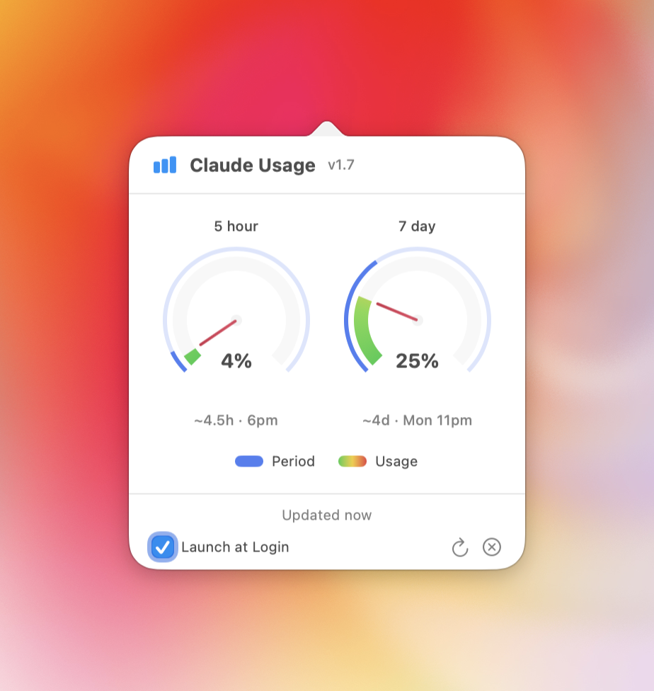

# Claude Usage

<p align="center">
  
</p>

A lightweight macOS menubar app that displays your Claude Code usage limits at a glance. 
<br><Br>
Built by [@richhickson](https://x.com/richhickson) with revisions by [@steveadams](https://x.com/steveadams)

## Features

- 🔄 **Auto-refresh** every 2 minutes
- 🚦 **Color-coded status** - Green (OK), Yellow (>70%), Red (>90%)
- ⏱️ **Time until reset** for both session and weekly limits
- 📊 **Session & Weekly limits** displayed together
- 🪶 **Lightweight** - Native Swift, minimal resources

## Installation

### Download

1. Go to [Releases](../../releases)
2. Download `ClaudeUsage.zip`
3. Unzip and drag `ClaudeUsage.app` to your Applications folder
4. Open the app (you may need to right-click → Open the first time)

### Build from Source

```bash
git clone https://github.com/YOUR_USERNAME/claude-usage.git
cd claude-usage
open ClaudeUsage.xcodeproj
```

Then build with ⌘B and run with ⌘R.

## Requirements

- macOS 13.0 (Ventura) or later
- Claude Code CLI installed and logged in

## Setup

1. Install [Claude Code](https://claude.ai/code) if you haven't already:
   ```bash
   npm install -g @anthropic-ai/claude-code
   ```

2. Log in to Claude Code:
   ```bash
   claude
   ```
   
3. Launch Claude Usage - it will read your credentials from Keychain automatically

## How It Works

Claude Usage reads your Claude Code OAuth credentials from macOS Keychain and queries the usage API endpoint at `api.anthropic.com/api/oauth/usage`.

**Note:** This uses an undocumented API that could change at any time. The app will gracefully handle API changes but may stop working if Anthropic modifies the endpoint.

## Privacy

- Your credentials never leave your machine
- No analytics or telemetry
- No data sent anywhere except Anthropic's API
- Open source - verify the code yourself

## Status Colours

| Normal | Warning | Critical |
|--------|---------|----------|
| 🟢 30% | 🟡 75% | 🔴 95% |

## Troubleshooting

### "Not logged in to Claude Code"

Run `claude` in Terminal and complete the login flow.

### App doesn't appear in menubar

Check if the app is running in Activity Monitor. Try quitting and reopening.

### Usage shows wrong values

Click the refresh button (↻) in the dropdown. If still wrong, your Claude Code session may have expired - run `claude` again.

## Contributing

PRs welcome! Please open an issue first to discuss major changes.

## License

MIT License - do whatever you want with it.

## Disclaimer

This is an unofficial tool not affiliated with Anthropic. It uses an undocumented API that may change without notice.

---

Made by [@richhickson](https://x.com/richhickson)
